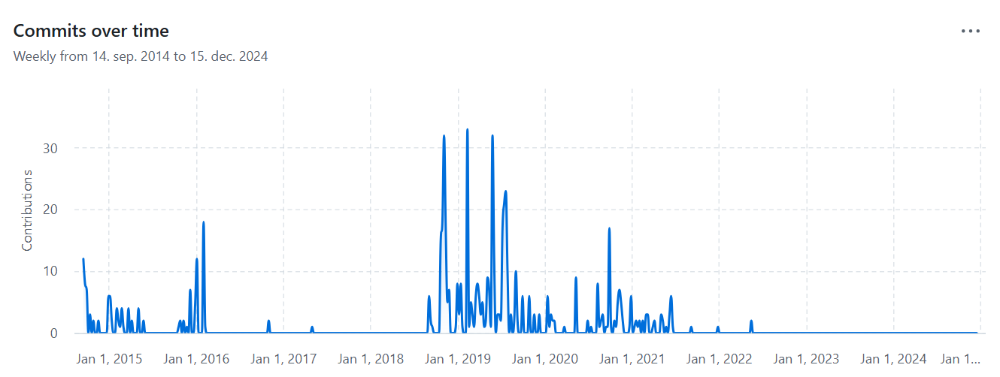
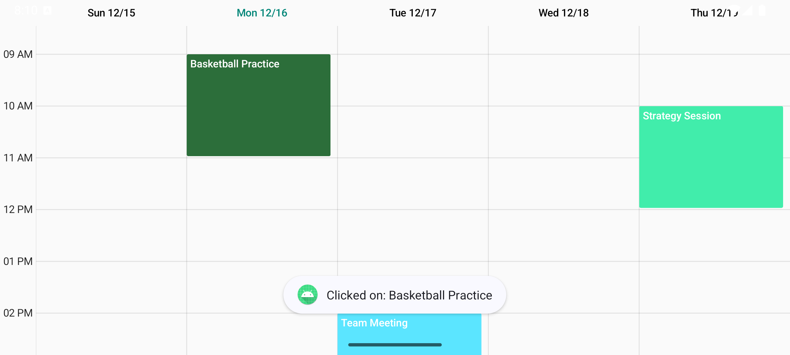

# Android Week View 📅

## Zakaj? 🤔

**Android Week View** je knjižnica za enostavno in fleksibilno prikazovanje tedenskega koledarja v Android aplikacijah. Ponuja čist in gladek vmesnik za prikazovanje dogodkov, njene prilagodljive funkcije pa omogočajo enostavno integracijo v vaše projekte. Knjižnica podpira Android API raven 14+ (Android 4.0) in omogoča odziven način za upravljanje in vizualizacijo dogodkov v tedenskem formatu. Je izpeljava iz druge knjižnice, ki jo je naredil [alamkanak](https://github.com/alamkanak/Android-Week-View), ki je narejena za Java aplikacije.

To knjižnico sem izbral, ker sem v svojem projektu potreboval knjižnico, ki lepo prikazuje dogodke. Poleg tega tudi lepo deluje in omogoča interakcijo z dogodki.

## Lastnosti ✅

- Enostavna implementacija in uporaba
- Podpora za več dogodkov na dan
- Prilagodljivi časovni intervali
- Pomikljiv tedenski pogled
- Podpora za dotik in geste
- Gladke animacije
- Podpira različne vrste dogodkov (celodnevni, časovno omejeni dogodki)

## Omejitve ❌

- Slaba dokumentacija, saj wiki, ki je na voljo, ne deluje.
- Je malo outdated, saj je zadnji commit bil 18. Maj, 2022. In ustvarjalec je naredil na githubu samo 3 commite v zadnjem letu.
- Nekatere funkcionalnosti moraš pogledat v change logu, saj na wiki niso posodobljene.

## Licenca 📜

Android Week View je na voljo pod Apache 2.0 licenco, kar omogoča uporabo tako za komercialne kot nekomercialne projekte. Več informacij o licenci najdete [tukaj](https://github.com/thellmund/Android-Week-View?tab=Apache-2.0-1-ov-file#readme).

## Ali je Android Week View brezplačen?

Da, Android Week View je brezplačen za uporabo. Knjižnica je na voljo pod Apache 2.0 licenco, kar pomeni, da jo lahko uporabljate v svojih projektih brezplačno.

## GitHub Statistika ⭐

- GitHub zvezdice: 189
- GitHub forki: 98

## Vzdrževanje projekta 🛠️

- Zadnji commit na GitHubu: 18. Maja 2022.
- Aktivnost commitov na GitHubu: 
- Odprtih 29 vprašanj in 6 pull requestov
- Največja kontributorja: thellmund in alamkanak

## Primer uporabe 🚀

```kotlin
data class MyEvent(
    val id: String,
    val title: String,
    val startTime: Calendar,
    val endTime: Calendar
)

class MyCustomSimpleAdapter(private val appContext: Context) : WeekView.SimpleAdapter<MyEvent>() {

    override fun onCreateEntity(item: MyEvent): WeekViewEntity {
        val randomColor = android.graphics.Color.rgb(
            (0..255).random(),
            (0..255).random(),
            (0..255).random()
        )

        return WeekViewEntity.Event.Builder(item)
            .setId(item.id.hashCode().toLong())
            .setTitle(item.title)
            .setStartTime(item.startTime)
            .setEndTime(item.endTime)
            .setStyle(WeekViewEntity.Style.Builder().setBackgroundColor(randomColor).build())
            .build()
    }

    override fun onEventClick(data: MyEvent) {
        Toast.makeText(appContext, "Clicked on: ${data.title}", Toast.LENGTH_SHORT).show()
    }
}
```

```kotlin
override fun onCreate(savedInstanceState: Bundle?) {
        super.onCreate(savedInstanceState)
        binding = ActivityActiveEventsBinding.inflate(layoutInflater)
        setContentView(binding.root)

        val adapter = MyCustomSimpleAdapter(this)
        binding.weekView.adapter = adapter

        adapter.submitList(hardcodedEvents)
    }
```



## Primer iz projekta

MyCustomSimpleAdapter:
```kotlin
package com.example.calender.basketball

import android.content.Intent
import android.util.Log
import android.widget.Toast
import androidx.appcompat.app.AlertDialog
import com.alamkanak.weekview.WeekView
import com.alamkanak.weekview.WeekViewEntity
import com.example.basketball.MapActivity
import com.google.firebase.auth.FirebaseAuth
import com.google.firebase.database.FirebaseDatabase
import com.google.firebase.database.DataSnapshot
import com.google.firebase.database.DatabaseError
import com.google.firebase.database.ValueEventListener
import kotlin.random.Random

class MyCustomSimpleAdapter() : WeekView.SimpleAdapter<MyEvent>() {

    private val auth: FirebaseAuth = FirebaseAuth.getInstance()
    private val database = FirebaseDatabase.getInstance().reference

    override fun onCreateEntity(item: MyEvent): WeekViewEntity {

        val randomColor = getRandomColor()
        return WeekViewEntity.Event.Builder(item)
            .setId(item.id.hashCode().toLong())
            .setTitle(item.title)
            .setStartTime(item.startTime)
            .setEndTime(item.endTime)
            .setStyle(WeekViewEntity.Style.Builder().setBackgroundColor(randomColor).build())
            .build()
    }

    override fun onEventClick(data: MyEvent) {
        data.location.let { location ->
            val intent = Intent(context, MapActivity::class.java)
            intent.putExtra("LOCATION", location)
            context.startActivity(intent)
            Log.d("MyCustomSimpleAdapter", "Event clicked: ${data.title}")
        }
    }

    override fun onEventLongClick(event: MyEvent) {
        showConfirmationDialog(event)
    }

    // Show a confirmation dialog
    private fun showConfirmationDialog(event: MyEvent) {
        val builder = AlertDialog.Builder(context)
        builder.setTitle("Unfollow Event")
            .setMessage("Are you sure you want to unfollow the event: ${event.title}?")
            .setPositiveButton("Yes") { dialog, _ ->
                unfollowEvent(event) 
                dialog.dismiss() 
            }
            .setNegativeButton("No") { dialog, _ ->
                dialog.dismiss()
            }

        builder.create().show()
    }

    // Function to unfollow the event
    private fun unfollowEvent(event: MyEvent) {
        val currentUser = auth.currentUser
        if (currentUser != null) {
            val userId = currentUser.uid
            val eventId = event.id
            Log.d("MyCustomSimpleAdapter", "Event ID: $eventId")

            val eventRef = database.child("events").child(eventId).child("followers")

            eventRef.addListenerForSingleValueEvent(object : ValueEventListener {
                override fun onDataChange(snapshot: DataSnapshot) {
                    val followers = snapshot.children.mapNotNull { it.getValue(String::class.java) }.toMutableList()
                    Log.d("MyCustomSimpleAdapter", "Followers: $followers")

                    if (followers.contains(userId)) {
                        followers.remove(userId)
                        eventRef.setValue(followers)
                            .addOnSuccessListener {
                                Toast.makeText(context, "Unfollowed event: ${event.title}", Toast.LENGTH_SHORT).show()
                            }
                            .addOnFailureListener {
                                Toast.makeText(context, "Failed to unfollow event", Toast.LENGTH_SHORT).show()
                            }
                    } else {
                        Toast.makeText(context, "You are not following this event", Toast.LENGTH_SHORT).show()
                    }
                }

                override fun onCancelled(error: DatabaseError) {
                    Toast.makeText(context, "Failed to load followers: ${error.message}", Toast.LENGTH_SHORT).show()
                }
            })
        } else {
            Toast.makeText(context, "No user logged in", Toast.LENGTH_SHORT).show()
        }
    }

    private fun getRandomColor(): Int {
        val random = Random.Default
        return android.graphics.Color.argb(
            255,
            random.nextInt(256),
            random.nextInt(256),
            random.nextInt(256)
        )
    }
}
```

LoadMore:
```kotlin
package com.example.basketball.calender

import java.util.Calendar

interface LoadMoreHandler {
    fun loadMore(startDate: Calendar, endDate: Calendar)
}
```
MyEvent:
```kotlin
// MyEvent.kt
package com.example.calender.basketball

import java.util.Calendar
import java.util.UUID

data class MyEvent(
    val id: String = UUID.randomUUID().toString(),
    val creator: String = "",
    val title: String,
    val startTime: Calendar,
    val endTime: Calendar,
    val location: String = "",
    val followers: MutableList<String> = mutableListOf()
) {
    // No-argument constructor required for Firebase
    constructor() : this("", "", "", Calendar.getInstance(), Calendar.getInstance(), "", mutableListOf())
}
```
ActiveEventsActivity:
```kotlin
package com.example.basketball

import android.content.Intent
import android.os.Bundle
import android.util.Log
import android.widget.Toast
import androidx.appcompat.app.AppCompatActivity
import com.example.basketball.calender.LoadMoreHandler
import com.example.calender.basketball.MyCustomSimpleAdapter
import com.example.calender.basketball.MyEvent
import com.example.basketball.databinding.ActivityActiveEventsBinding
import com.google.firebase.auth.FirebaseAuth
import com.google.firebase.database.*
import java.util.Calendar
import java.util.UUID

import com.example.basketball.utils.toMyEvent

class ActiveEventsActivity : AppCompatActivity(), LoadMoreHandler {

    private lateinit var binding: ActivityActiveEventsBinding
    private val events = mutableListOf<MyEvent>()
    private lateinit var database: DatabaseReference
    private lateinit var auth: FirebaseAuth

    override fun onCreate(savedInstanceState: Bundle?) {
        super.onCreate(savedInstanceState)
        binding = ActivityActiveEventsBinding.inflate(layoutInflater)
        setContentView(binding.root)

        auth = FirebaseAuth.getInstance()
        database = FirebaseDatabase.getInstance().reference.child("events")

        val adapter = MyCustomSimpleAdapter()
        binding.weekView.adapter = adapter

        // Load events from the database
        loadEventsFromDatabase(adapter)

        binding.createEventButton.setOnClickListener {
            val intent = Intent(this, CreateEventActivity::class.java)
            startActivityForResult(intent, REQUEST_CODE_CREATE_EVENT)
        }

        binding.backButton.setOnClickListener {
            finish()
        }
    }

    private fun loadEventsFromDatabase(adapter: MyCustomSimpleAdapter) {
        val currentUser = auth.currentUser
        if (currentUser != null) {
            database.addValueEventListener(object : ValueEventListener {
                override fun onDataChange(snapshot: DataSnapshot) {
                    events.clear()
                    for (eventSnapshot in snapshot.children) {
                        val eventMap = eventSnapshot.value as? Map<String, Any>
                        if (eventMap != null) {
                            Log.d("ActiveEventsActivity", "Event: $eventMap")
                            val id = eventMap["id"] as String
                            val startTimeMap = eventMap["startTime"] as? Map<String, Any>
                            val endTimeMap = eventMap["endTime"] as? Map<String, Any>
                            val startTimeInMillis = (startTimeMap?.get("timeInMillis") as? Number)?.toLong() ?: 0L
                            val endTimeInMillis = (endTimeMap?.get("timeInMillis") as? Number)?.toLong() ?: 0L
                            val event = MyEvent(
                                id = id,
                                creator = eventMap["creator"] as? String ?: "",
                                title = eventMap["title"] as? String ?: "",
                                startTime = Calendar.getInstance().apply { timeInMillis = startTimeInMillis },
                                endTime = Calendar.getInstance().apply { timeInMillis = endTimeInMillis },
                                location = eventMap["location"] as? String ?: "",
                                followers = (eventMap["followers"] as? List<String>)?.toMutableList() ?: mutableListOf()
                            )
                            if (event.followers.contains(currentUser.uid)) {
                                events.add(event)
                            }
                        }
                    }
                    if (events.isEmpty()) {
                        Toast.makeText(this@ActiveEventsActivity, "No followed events", Toast.LENGTH_SHORT).show()
                    } else {
                        loadMore(Calendar.getInstance(), Calendar.getInstance().apply {
                            add(Calendar.MONTH, 1)
                        })
                        adapter.submitList(events)
                    }
                }

                override fun onCancelled(error: DatabaseError) {
                    Toast.makeText(this@ActiveEventsActivity, "Failed to load events: ${error.message}", Toast.LENGTH_SHORT).show()
                }
            })
        } else {
            Toast.makeText(this, "No user logged in", Toast.LENGTH_SHORT).show()
        }
    }

    override fun loadMore(startDate: Calendar, endDate: Calendar) {
        val filteredEvents = getEvents(startDate, endDate)
        val adapter = binding.weekView.adapter as MyCustomSimpleAdapter
        adapter.submitList(filteredEvents)
    }

    private fun getEvents(startDate: Calendar, endDate: Calendar): List<MyEvent> {
        return events.filter { it.startTime >= startDate && it.endTime <= endDate }
    }

    override fun onActivityResult(requestCode: Int, resultCode: Int, data: Intent?) {
        super.onActivityResult(requestCode, resultCode, data)
        if (requestCode == REQUEST_CODE_CREATE_EVENT && resultCode == RESULT_OK) {
            val newEvent = data?.getBundleExtra("NEW_EVENT")?.toMyEvent()
            if (newEvent != null) {
                events.add(newEvent)
                loadMore(Calendar.getInstance(), Calendar.getInstance().apply {
                    add(Calendar.MONTH, 1)
                })
            }
        }
    }

    companion object {
        private const val REQUEST_CODE_CREATE_EVENT = 1
    }
}
```
Rezultat:

Tukaj je prikaz delovanja knjižnice v moji aplikaciji.


