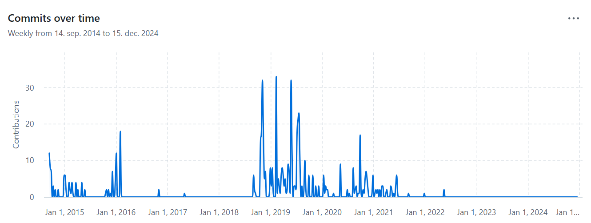

# Android Week View 📅

## Zakaj? 🤔

**Android Week View** je knjižnica za enostavno in fleksibilno prikazovanje tedenskega koledarja v Android aplikacijah. Ponuja čist in gladek vmesnik za prikazovanje dogodkov, njene prilagodljive funkcije pa omogočajo enostavno integracijo v vaše projekte. Knjižnica podpira Android API raven 14+ (Android 4.0) in omogoča odziven način za upravljanje in vizualizacijo dogodkov v tedenskem formatu. Je izpeljava iz druge knjižnice, ki jo je naredil [alamkanak](https://github.com/alamkanak/Android-Week-View), ki je narejena za Java aplikacije.

To knjižnico sem izbral, ker sem v svojem projektu potreboval knjižnico, ki lepo prikazuje dogodke. Poleg tega tudi lepo deluje in omogoča interakcijo z dogodki.

## Lastnosti ✅

- Enostavna implementacija in uporaba
- Podpora za več dogodkov na dan
- Prilagodljivi časovni intervali
- Pomikljiv tedenski pogled
- Podpora za dotik in geste
- Gladke animacije
- Podpira različne vrste dogodkov (celodnevni, časovno omejeni dogodki)

## Omejitve ❌

- Slaba dokumentacija, saj wiki, ki je na voljo, ne deluje.
- Je malo outdated, saj je zadnji commit bil 18. Maj, 2022. In ustvarjalec je naredil na githubu samo 3 commite v zadnjem letu.
- Nekatere funkcionalnosti moraš pogledat v change logu, saj na wiki niso posodobljene.

## Licenca 📜

```plaintext
MIT Licenca
```

## Ali je Android Week View brezplačen?

Da, Android Week View je brezplačen za uporabo. Knjižnica je na voljo pod MIT licenco, kar pomeni, da jo lahko uporabljate v svojih projektih brezplačno.

## GitHub Statistika ⭐

- GitHub zvezdice: 189
- GitHub sledilci: 12
- GitHub forki: 98

## Vzdrževanje projekta 🛠️

- Zadnji commit na GitHubu: 18. Maja 2022.
- Aktivnost commitov na GitHubu: 
- Odprtih 29 vprašanj in 6 pull requestov
- Največja kontributorja: thellmund in alamkanak

## Primer uporabe 🚀

